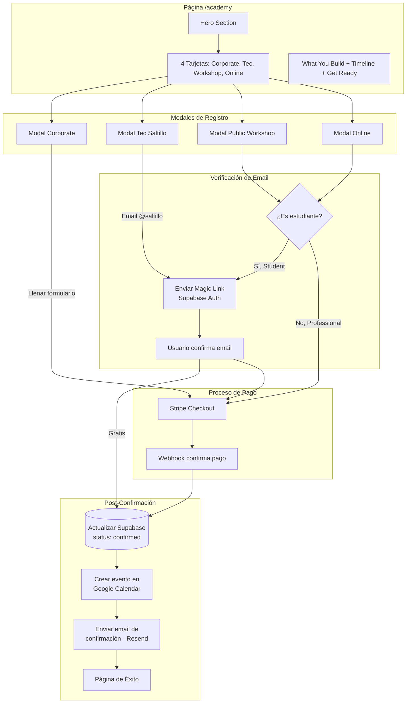
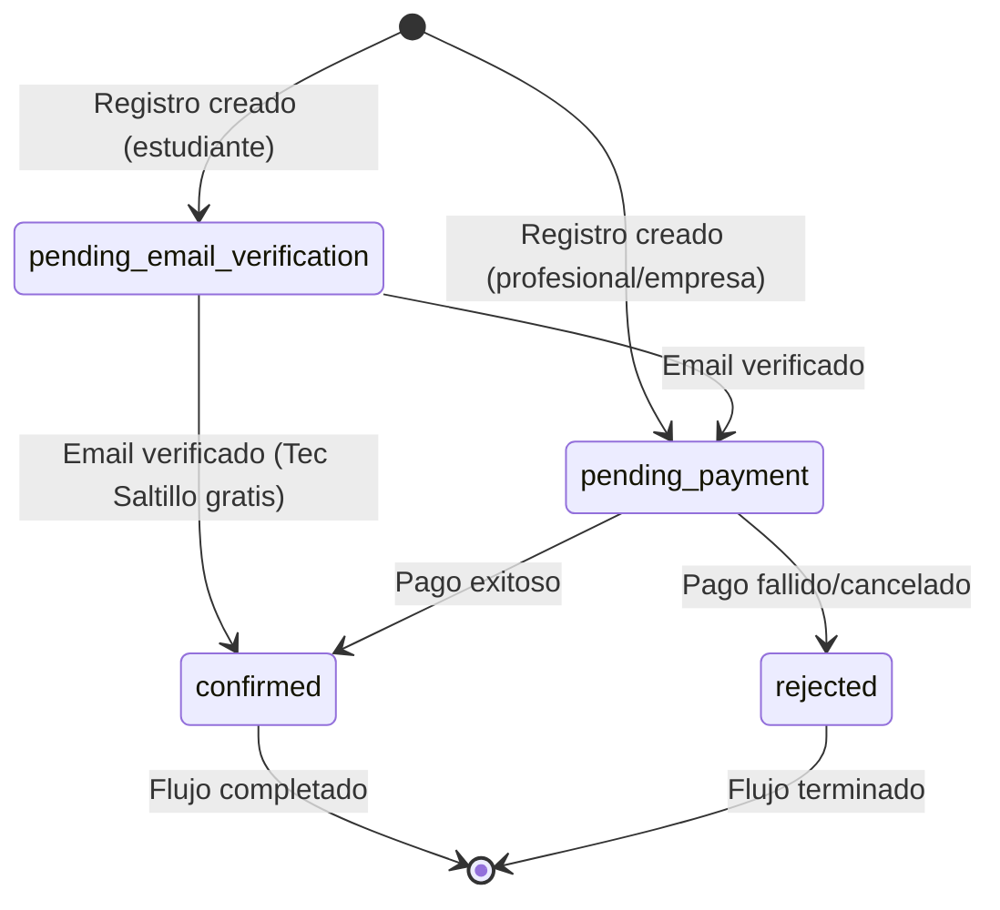

# Academy Page - Documentación Completa del Producto Final

## Descripción General

La página `/academy` es el hub central para el programa de especialización **"AI for Engineering"**, un curso intensivo de 8 horas que transforma a estudiantes y profesionales en desarrolladores de soluciones industriales con IA.

---

## Estructura Visual de la Página

### 1. Hero Section
```
┌─────────────────────────────────────────────────────────────────┐
│  [Badge: Professional Specialization]                           │
│                                                                 │
│  AI for Engineering                                             │
│  ─────────────────                                              │
│  Transform into a Full-Stack AI Engineer in 8 intensive hours.  │
│  Build real infrastructure connecting Next.js, Python,          │
│  Supabase, and Manufacturing Data.                              │
│                                                                 │
└─────────────────────────────────────────────────────────────────┘
```

### 2. Choose Your Path (4 Tarjetas con Imagen)
```
┌─────────────────┐ ┌─────────────────┐ ┌─────────────────┐ ┌─────────────────┐
│ [company.webp]  │ │ [tec.webp]      │ │ [students.webp] │ │ [online.webp]   │
│                 │ │ [Badge: FREE]   │ │                 │ │ [Badge: 10%OFF] │
│ Corporate       │ │ Tec Saltillo    │ │ Public          │ │ Online          │
│ Training        │ │ Event           │ │ Workshop        │ │ Training        │
│                 │ │                 │ │                 │ │                 │
│ In-house for    │ │ Exclusive for   │ │ Open to         │ │ Live sessions   │
│ your team       │ │ ITS students    │ │ students &      │ │ via Google Meet │
│                 │ │                 │ │ professionals   │ │                 │
└─────────────────┘ └─────────────────┘ └─────────────────┘ └─────────────────┘
```

### 3. What You Will Build
- Modern Web Interface (Next.js 16 + Tailwind CSS v4)
- Cloud Database (Supabase PostgreSQL + RLS + Auth)
- AI Agents (Python FastAPI + Hugging Face LLMs)
- Excel Integration (VBA Macros + Cloud API)

### 4. Course Timeline (6 Módulos)
| Bloque | Duración | Contenido |
|--------|----------|-----------|
| I | 1.0h | Infraestructura Ágil & Google Antigravity |
| II | 2.0h | Backend & IA Real (FastAPI + Hugging Face) |
| III | 1.5h | Frontend & Auth (Next.js + Supabase Auth) |
| IV | 1.5h | Automatización & 3D (n8n + Blender MCP) |
| V | 1.0h | El Puente con Excel (VBA + API) |
| VI | 1.0h | Deploy & Dominio (Vercel + CI/CD) |

### 5. Get Ready (Checklist de Requisitos)
- [ ] Laptop con 12GB+ RAM y SSD
- [ ] Windows 10/11 o macOS actualizado
- [ ] Google Antigravity IDE instalado
- [ ] Claude Desktop instalado
- [ ] Git instalado
- [ ] WSL instalado (solo Windows)
- [ ] Cuenta de GitHub activa
- [ ] Cuenta de Google activa

### 6. Sidebar (Desktop Only)
- **Upcoming Sets**: Próximos eventos con fechas y lugares
- **Prerequisites**: Resumen de requisitos técnicos

---

## Tipos de Cliente y Precios

### 1. Empresas (Corporate Training)
| Personas | Precio Total | Precio/Persona |
|----------|-------------|----------------|
| 5 | $17,500 MXN | $3,500 |
| 6 | $19,000 MXN | $3,166 |
| 7 | $20,500 MXN | $2,928 |
| 8 | $22,000 MXN | $2,750 |
| 9 | $23,500 MXN | $2,611 |
| 10 | $25,000 MXN | $2,500 |
| 11 | $26,500 MXN | $2,409 |
| 12 | $28,000 MXN | $2,333 |

**Incluye:** Comida durante el break, opción de capacitación in-situ.

### 2. Profesionales (Presencial)
| Personas | Precio/Persona | Descuento |
|----------|---------------|-----------|
| 1-4 | $2,950 MXN | - |
| 5-6 | $2,700 MXN | 8% |
| 7-8 | $2,500 MXN | 15% |
| 9-10 | $2,300 MXN | 22% |
| 11-12 | $2,200 MXN | 25% |

### 3. Estudiantes (Presencial)
| Personas | Precio/Persona | Descuento |
|----------|---------------|-----------|
| 1-4 | $1,150 MXN | - |
| 5-6 | $1,050 MXN | 9% |
| 7-8 | $980 MXN | 15% |
| 9-10 | $920 MXN | 20% |
| 11-12 | $860 MXN | 25% |

**Requisito:** Email institucional (.edu, .edu.mx, .tecnm.mx, etc.)

### 4. Online - Profesionales
| Personas | Precio/Persona | Notas |
|----------|---------------|-------|
| 1 (individual) | $2,655 MXN | Solo entre semana |
| 2-4 | $2,500 MXN | 10% desc. base |
| 5-6 | $2,350 MXN | Desc. adicional |
| 7-8 | $2,200 MXN | Desc. adicional |
| 9-12 | $2,100 MXN | Desc. adicional |

### 5. Online - Estudiantes
| Personas | Precio/Persona | Notas |
|----------|---------------|-------|
| 1 (individual) | $1,035 MXN | Solo entre semana |
| 2-4 | $1,000 MXN | 10% desc. base |
| 5-6 | $950 MXN | Desc. adicional |
| 7-8 | $900 MXN | Desc. adicional |
| 9-12 | $850 MXN | Desc. adicional |

### 6. Tec Saltillo (Evento Especial)
- **Precio:** GRATIS
- **Requisito:** Email @saltillo.tecnm.mx
- **Fecha:** 24 de enero de 2026
- **Límite:** 12 personas

---

## Diagrama de Flujos



---

## Flujos Detallados por Tipo de Cliente

### Flujo 1: Empresa (Corporate Training)

```
1. USUARIO ABRE MODAL
   └── Click en tarjeta "Corporate Training"
   └── Modal se abre con formulario

2. USUARIO LLENA FORMULARIO
   ├── Full Name (requerido)
   ├── Email (requerido, cualquier email)
   ├── Phone (opcional)
   ├── Attendees: 5-12 (requerido)
   ├── Location: In-Company / AppCreatorBR Offices
   └── Fecha: Seleccionar del calendario
       └── Calendario muestra fechas bloqueadas de Google Calendar

3. USUARIO VE RESUMEN
   ├── Tipo: Corporate
   ├── Personas: X
   ├── Precio/persona: $X,XXX MXN
   └── Total: $XX,XXX MXN

4. USUARIO PROCEDE AL PAGO
   └── Click "Proceed to Payment"
   └── Redirección a Stripe Checkout

5. STRIPE PROCESA PAGO
   ├── Usuario ingresa datos de tarjeta
   ├── Pago exitoso
   └── Stripe envía webhook a /api/stripe/webhook

6. SISTEMA CONFIRMA
   ├── Actualiza course_registrations.status = 'confirmed'
   ├── Crea evento en Google Calendar del instructor
   ├── Envía email de confirmación via Resend
   └── Redirige a /academy/success

7. USUARIO RECIBE
   ├── Email con detalles del curso
   ├── Invitación de calendario
   └── Información sobre el diploma
```

### Flujo 2: Estudiante Tec Saltillo (Gratis)

```
1. USUARIO ABRE MODAL
   └── Click en tarjeta "Tec Saltillo Event"
   └── Modal pequeño se abre (sin calendario)

2. USUARIO LLENA FORMULARIO
   ├── Full Name (requerido)
   ├── Email (requerido, DEBE ser @saltillo.tecnm.mx)
   └── Phone (opcional)

3. VALIDACIÓN DE EMAIL
   ├── Sistema verifica que email termine en @saltillo.tecnm.mx
   └── Si no es válido: "Este evento es exclusivo para estudiantes del ITS"

4. VERIFICACIÓN DE EMAIL
   ├── Click "Proceed to Verification"
   ├── Sistema crea registro con status='pending_email_verification'
   ├── Supabase Auth envía Magic Link al email
   └── Usuario ve mensaje: "Revisa tu email para verificar"

5. USUARIO VERIFICA
   ├── Abre email
   ├── Click en Magic Link
   └── Redirige a /academy/verify-callback

6. SISTEMA CONFIRMA (SIN PAGO)
   ├── Verifica que email es @saltillo.tecnm.mx
   ├── Actualiza status = 'confirmed' (es gratis)
   ├── Crea evento en Google Calendar
   ├── Envía email de confirmación
   └── Redirige a /academy/success

7. USUARIO RECIBE
   ├── Email de confirmación
   ├── Instrucciones para el día del evento
   └── Información sobre el diploma
```

### Flujo 3: Estudiante (Public Workshop o Online)

```
1. USUARIO ABRE MODAL
   └── Click en "Public Workshop" o "Online Training"

2. USUARIO SELECCIONA TICKET TYPE
   └── Selecciona "Student"
   └── Ve precio de estudiante: "From $860/person"

3. USUARIO LLENA FORMULARIO
   ├── Full Name
   ├── Email (DEBE ser institucional: .edu, .edu.mx, .tecnm.mx, etc.)
   ├── Phone
   ├── Attendees
   └── Fecha (calendario o evento programado)

4. VALIDACIÓN DE EMAIL INSTITUCIONAL
   ├── Sistema verifica dominio del email
   └── Si no es institucional: "Ingresa tu email institucional para la tarifa de estudiante"

5. VERIFICACIÓN DE EMAIL
   ├── Click "Proceed to Verification"
   ├── Sistema crea registro con status='pending_email_verification'
   ├── Supabase Auth envía Magic Link
   └── Usuario espera email

6. USUARIO VERIFICA EMAIL
   ├── Click en Magic Link
   └── Redirige a /academy/verify-callback
   └── Status cambia a 'pending_payment'

7. USUARIO PROCEDE AL PAGO
   └── Redirige a /academy/payment?registrationId=XXX
   └── Muestra resumen y botón para Stripe

8. STRIPE PROCESA PAGO
   └── Checkout con precio de estudiante

9. SISTEMA CONFIRMA
   ├── Actualiza status = 'confirmed'
   ├── Crea evento en Google Calendar
   ├── Envía email de confirmación
   └── Redirige a /academy/success
```

### Flujo 4: Profesional (Public Workshop o Online)

```
1. USUARIO ABRE MODAL
   └── Click en "Public Workshop" o "Online Training"

2. USUARIO SELECCIONA TICKET TYPE
   └── Selecciona "Professional"
   └── Ve precio profesional: "From $2,200/person"

3. USUARIO LLENA FORMULARIO
   ├── Full Name
   ├── Email (cualquier email válido)
   ├── Phone
   ├── Attendees
   └── Fecha (calendario o evento programado)

4. SIN VERIFICACIÓN DE EMAIL
   └── Profesionales NO necesitan verificar email

5. USUARIO PROCEDE AL PAGO
   └── Click "Proceed to Payment"
   └── Redirección DIRECTA a Stripe Checkout

6. STRIPE PROCESA PAGO
   └── Checkout con precio profesional

7. SISTEMA CONFIRMA
   ├── Actualiza status = 'confirmed'
   ├── Crea evento en Google Calendar
   ├── Envía email de confirmación
   └── Redirige a /academy/success
```

### Flujo 5: Online Individual (Entre Semana)

```
1. USUARIO ABRE MODAL ONLINE
   └── Click en "Online Training"

2. SELECCIONA 1 PERSONA
   └── Attendees = 1

3. CALENDARIO MUESTRA SOLO DÍAS DE SEMANA
   ├── Sábados y domingos deshabilitados
   └── Mensaje: "Individual sessions available Monday-Friday only"

4. RESTO DEL FLUJO
   └── Igual que Profesional u Estudiante según ticket type
```

---

## Integraciones Técnicas

### Supabase

**Tablas involucradas:**

```sql
-- Registros de cursos
course_registrations (
  id uuid PRIMARY KEY,
  course_id text,              -- 'ai-engineering-2026'
  event_date date,
  full_name text,
  email text,
  phone text,
  attendee_type enum,          -- 'student', 'professional', 'company'
  attendees integer,
  status enum,                 -- 'pending_email_verification', 'pending_payment', 'confirmed', 'rejected'
  payment_id text,             -- Stripe session ID
  email_verified_at timestamptz,
  confirmed_at timestamptz,
  created_at timestamptz
)

-- Configuración (variables encriptadas)
app_config (
  key text PRIMARY KEY,
  value text                   -- Encriptado
)
-- Contiene: GOOGLE_CLIENT_ID, GOOGLE_CLIENT_SECRET, GOOGLE_REFRESH_TOKEN
```

**Supabase Auth:**
- Maneja Magic Links para verificación de email
- Template personalizado con branding de AppCreatorBR
- Expira en 24 horas

### Stripe

**Configuración:**
```
STRIPE_SECRET_KEY          - Clave secreta
STRIPE_PUBLISHABLE_KEY     - Clave pública (frontend)
STRIPE_WEBHOOK_SECRET      - Para verificar webhooks
```

**Flujo de Checkout:**
1. Frontend llama a `/api/stripe/create-checkout`
2. Backend crea Stripe Checkout Session con:
   - Precio calculado según tipo y cantidad
   - Metadata: registrationId, type, attendees, date
   - Success URL: /academy/success?session_id={ID}
   - Cancel URL: /academy?cancelled=true
3. Usuario completa pago en Stripe
4. Stripe envía webhook `checkout.session.completed`
5. Backend procesa y confirma registro

### Google Calendar

**Configuración:**
- Credenciales OAuth2 almacenadas en Supabase app_config
- Acceso al calendario principal del instructor

**Funcionalidades:**

1. **Consultar disponibilidad:**
   - GET `/api/calendar/availability`
   - Retorna fechas con eventos de 8 horas (bloqueadas)
   - Frontend deshabilita estas fechas en el calendario

2. **Crear evento al confirmar:**
   - POST cuando el registro se confirma
   - Título: "AI Engineering - {Tipo} - {Nombre}"
   - Duración: 8 horas (9:00 - 17:00)
   - Incluye break de 1 hora (13:00 - 14:00)
   - Descripción con todos los detalles del registro

### Resend (Emails)

**Configuración:**
```
RESEND_API_KEY - Clave de API
```

**Emails enviados:**

1. **Confirmación de registro:**
   - Disparado después de pago exitoso o verificación (Tec Saltillo)
   - Contiene: Fecha, hora, ubicación, instrucciones
   - Template con branding de AppCreatorBR

2. **Recordatorio (futuro):**
   - 1 día antes del evento
   - Recordar requisitos técnicos

3. **Post-curso (futuro):**
   - Link al diploma
   - Encuesta de satisfacción

---

## Estados del Registro



---

## Diseño de Modales

### Estructura Consistente (con calendario)

```
┌─────────────────────────────────────────────────────────────┐
│  [Título del Modal]                                     [X] │
│  Subtítulo descriptivo                                      │
├─────────────────────────────────────────────────────────────┤
│                                                             │
│  ┌────────────────────────┐   ┌─────────────────────────┐  │
│  │ FORMULARIO             │   │ CALENDARIO              │  │
│  │                        │   │                         │  │
│  │ • Ticket Type          │   │    Enero 2026           │  │
│  │ • Full Name            │   │  Do Lu Ma Mi Ju Vi Sa   │  │
│  │ • Email / Phone        │   │      1  2  3  4  5  6   │  │
│  │ • Attendees            │   │   7  8  9 10 11 12 13   │  │
│  │ • Location (corp)      │   │  14 15 16 17 18 19 20   │  │
│  │                        │   │  21 22 23 24 25 26 27   │  │
│  │ ┌──────────────────┐   │   │  28 29 30 31            │  │
│  │ │ SUMMARY          │   │   │                         │  │
│  │ │ Total: $XX,XXX   │   │   │ ● Selected ○ Available  │  │
│  │ │ X personas       │   │   │ ○ Unavailable           │  │
│  │ └──────────────────┘   │   └─────────────────────────┘  │
│  └────────────────────────┘                                │
│                                                             │
├─────────────────────────────────────────────────────────────┤
│                    [Cancel]  [Proceed to Payment]           │
└─────────────────────────────────────────────────────────────┘
```

### Dimensiones:
- **Con calendario:** max-w-4xl (896px)
- **Sin calendario (Tec Saltillo):** max-w-lg (512px)
- **Altura máxima:** 85vh con scroll interno

---

## Página de Éxito (/academy/success)

```
┌─────────────────────────────────────────┐
│                                         │
│            ✓ (ícono grande)             │
│                                         │
│      ¡Registro Confirmado!              │
│                                         │
│   Tu lugar ha sido reservado para       │
│   el curso de AI Engineering.           │
│                                         │
│  ┌───────────────────────────────────┐  │
│  │ 📧 Revisa tu email                │  │
│  │    Te enviamos los detalles       │  │
│  └───────────────────────────────────┘  │
│                                         │
│  ┌───────────────────────────────────┐  │
│  │ 📅 Evento en tu calendario        │  │
│  │    Agregamos el evento            │  │
│  └───────────────────────────────────┘  │
│                                         │
│  ┌───────────────────────────────────┐  │
│  │ 📜 Diploma                        │  │
│  │    Al completar recibirás tu      │  │
│  │    diploma de especialización     │  │
│  └───────────────────────────────────┘  │
│                                         │
│  ┌───────────────────────────────────┐  │
│  │ ⚠️ Importante: Asegúrate de      │  │
│  │    tener todo listo. Revisa       │  │
│  │    "Get Ready" en la página.      │  │
│  └───────────────────────────────────┘  │
│                                         │
│        [Volver al curso]                │
│        [Ir al inicio]                   │
│                                         │
└─────────────────────────────────────────┘
```

---

## Eventos Programados (2026)

| Fecha | Ubicación | Tipo | Precio | Notas |
|-------|-----------|------|--------|-------|
| 24 Enero | Tec Saltillo | Gratis | $0 | Solo @saltillo.tecnm.mx |
| 31 Enero | Alebrije Café | Normal | Según tipo | Abierto |
| 7 Febrero | Alebrije Café | Normal | Según tipo | Abierto |

Los usuarios también pueden solicitar fechas personalizadas sujeto a disponibilidad en Google Calendar.

---

## Reglas de Negocio Importantes

1. **Límite de personas:** Máximo 12 por sesión
2. **Mínimo para fecha personalizada:** 5 personas
3. **Online individual:** Solo días de semana (lunes a viernes)
4. **Verificación de email:** Solo para estudiantes
5. **Break:** 1 hora incluida (13:00-14:00)
6. **Comida:** Solo incluida para empresas
7. **Diploma:** Todos reciben diploma al completar el curso

---

## Variables de Entorno Requeridas

```env
# Supabase
NEXT_PUBLIC_SUPABASE_URL=https://xxx.supabase.co
NEXT_PUBLIC_SUPABASE_ANON_KEY=xxx
SUPABASE_SERVICE_ROLE_KEY=xxx

# Stripe
STRIPE_SECRET_KEY=sk_live_xxx
NEXT_PUBLIC_STRIPE_PUBLISHABLE_KEY=pk_live_xxx
STRIPE_WEBHOOK_SECRET=whsec_xxx

# Resend
RESEND_API_KEY=re_xxx

# App
NEXT_PUBLIC_BASE_URL=https://appcreatorbr.com

# Google Calendar (en Supabase app_config, encriptadas)
# GOOGLE_CLIENT_ID
# GOOGLE_CLIENT_SECRET
# GOOGLE_REFRESH_TOKEN
```

---

## Endpoints de API

| Método | Ruta | Descripción |
|--------|------|-------------|
| GET | `/api/calendar/availability` | Obtener fechas bloqueadas |
| POST | `/api/calendar/create-event` | Crear evento en calendario |
| POST | `/api/stripe/create-checkout` | Crear sesión de Stripe |
| POST | `/api/stripe/webhook` | Recibir webhooks de Stripe |
| GET | `/academy/verify-callback` | Callback de Magic Link |
| GET | `/academy/success` | Página de éxito |

---

## Checklist de Funcionalidades

### UI/UX
- [ ] Hero section con badge y descripción
- [ ] 4 tarjetas con imágenes de Supabase Storage
- [ ] Sección "What You Will Build"
- [ ] Timeline del curso (6 módulos)
- [ ] Sección "Get Ready" con checklist
- [ ] Sidebar sticky en desktop
- [ ] Modales consistentes con layout de 2 columnas
- [ ] Responsive en móvil

### Modales
- [ ] Corporate: Formulario + Calendario + Summary
- [ ] Tec Saltillo: Formulario simple (sin calendario)
- [ ] Public Workshop: Ticket type + Evento o Custom date
- [ ] Online: Ticket type + Calendario (weekdays para individual)

### Integraciones
- [ ] Supabase Auth (Magic Links)
- [ ] Supabase Database (registros)
- [ ] Stripe Checkout (pagos)
- [ ] Stripe Webhooks (confirmación)
- [ ] Google Calendar (disponibilidad + crear eventos)
- [ ] Resend (emails de confirmación)

### Flujos
- [ ] Empresa → Pago directo → Confirmación
- [ ] Profesional → Pago directo → Confirmación
- [ ] Estudiante → Verificar email → Pago → Confirmación
- [ ] Tec Saltillo → Verificar email → Confirmación (gratis)